# Tài liệu Thiết kế: Tích hợp Keycloak SSO cho Hải Long Enterprise

## 1. Tổng quan

### 1.1 Mục tiêu
Thiết kế và triển khai hệ thống Single Sign-On (SSO) sử dụng Keycloak làm nền tảng quản lý xác thực và phân quyền tập trung cho 3 hệ thống con của Hải Long Enterprise:

| # | Hệ thống | Mô tả | Trạng thái |
|---|----------|-------|------------|
| 1 | **Quản lý Nhà máy (Factory Management)** | Hệ thống quản lý kho, sản xuất, vật tư | ✅ Đã có - Cần tích hợp |
| 2 | **Quản lý HRM** | Hệ thống quản lý nhân sự, chấm công, lương | 🆕 Chưa có - Cần xây dựng |
| 3 | **Quản lý Máy móc (Equipment Management)** | Hệ thống quản lý tài sản, bảo trì máy móc | 🆕 Chưa có - Cần xây dựng |

### 1.2 Lợi ích của SSO với Keycloak

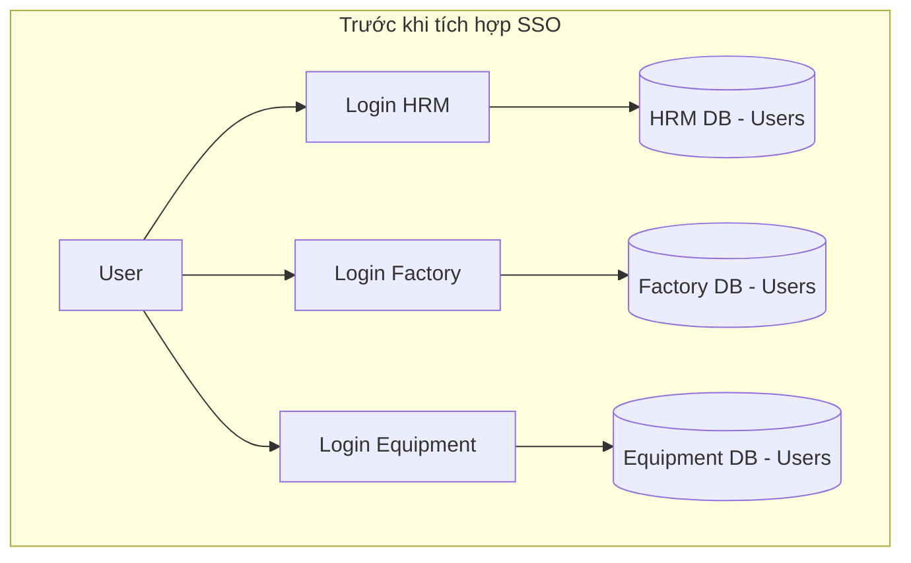

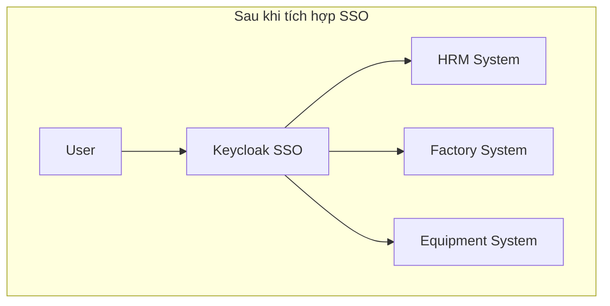

**Lợi ích chính:**
- ✅ Đăng nhập một lần, truy cập tất cả hệ thống
- ✅ Quản lý user và phân quyền tập trung
- ✅ Bảo mật cao với OAuth 2.0 / OpenID Connect
- ✅ Hỗ trợ 2FA, Social Login, LDAP/AD integration
- ✅ Audit logging đầy đủ
- ✅ Dễ mở rộng thêm hệ thống mới

---

## 2. Kiến trúc Hệ thống

### 2.1 Kiến trúc Tổng thể

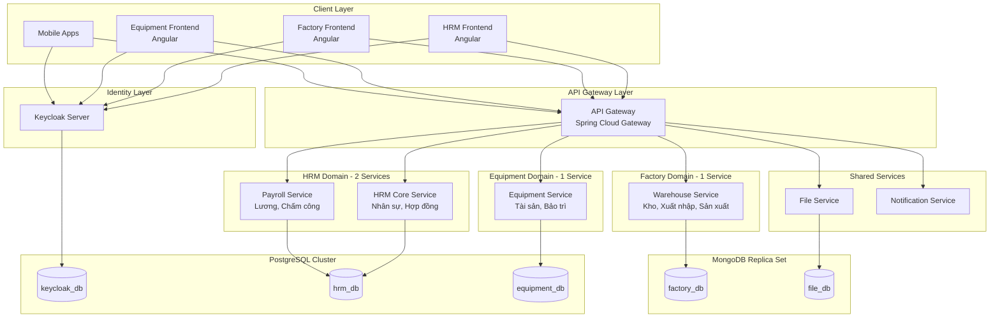

### 2.2 Chi tiết Services

| Domain | Service | Chức năng chính | Database | Tech Stack |
|--------|---------|-----------------|----------|------------|
| **Identity** | Keycloak | SSO, Auth, RBAC | PostgreSQL | Keycloak 24+ |
| **HRM** | HRM Core Service | Quản lý nhân viên, hợp đồng, phòng ban, tổ chức | PostgreSQL | Spring Boot 3 |
| **HRM** | Payroll Service | Bảng lương, chấm công, tính lương, bảo hiểm | PostgreSQL | Spring Boot 3 |
| **Factory** | Warehouse Service | Quản lý kho, phiếu xuất/nhập, sản xuất, vật tư | MongoDB | Spring Boot 3 |
| **Equipment** | Equipment Service | Quản lý tài sản, máy móc, lịch bảo trì, khấu hao | PostgreSQL | Spring Boot 3 |
| **Shared** | File Service | Upload/download files, document management | MongoDB (GridFS) | Spring Boot 3 |
| **Shared** | Notification Service | Email, SMS, Push notifications | - (stateless) | Spring Boot 3 |

### 2.3 Database Architecture

```
┌─────────────────────────────────────────────────────────────────────────┐
│                        DATABASE ARCHITECTURE                             │
├─────────────────────────────────────────────────────────────────────────┤
│                                                                          │
│   PostgreSQL Cluster (RDBMS)              MongoDB Replica Set (NoSQL)   │
│   ─────────────────────────               ───────────────────────────   │
│                                                                          │
│   ┌──────────────────────┐                ┌──────────────────────┐      │
│   │  keycloak_db         │                │  factory_db          │      │
│   │  ────────────────    │                │  ────────────────    │      │
│   │  • users             │                │  • warehouses        │      │
│   │  • roles             │                │  • materials         │      │
│   │  • clients           │                │  • receipts          │      │
│   │  • sessions          │                │  • production_orders │      │
│   └──────────────────────┘                └──────────────────────┘      │
│                                                                          │
│   ┌──────────────────────┐                ┌──────────────────────┐      │
│   │  hrm_db              │                │  file_db             │      │
│   │  ────────────────    │                │  ────────────────    │      │
│   │  • employees         │                │  • fs.files (GridFS) │      │
│   │  • contracts         │                │  • fs.chunks         │      │
│   │  • departments       │                │  • file_metadata     │      │
│   │  • positions         │                └──────────────────────┘      │
│   │  • salaries          │                                              │
│   │  • attendances       │                                              │
│   │  • leaves            │                                              │
│   └──────────────────────┘                                              │
│                                                                          │
│   ┌──────────────────────┐                                              │
│   │  equipment_db        │                                              │
│   │  ────────────────    │                                              │
│   │  • assets            │                                              │
│   │  • machines          │                                              │
│   │  • maintenance_plans │                                              │
│   │  • work_orders       │                                              │
│   │  • depreciation      │                                              │
│   └──────────────────────┘                                              │
│                                                                          │
└─────────────────────────────────────────────────────────────────────────┘
```

### 2.4 Service Communication

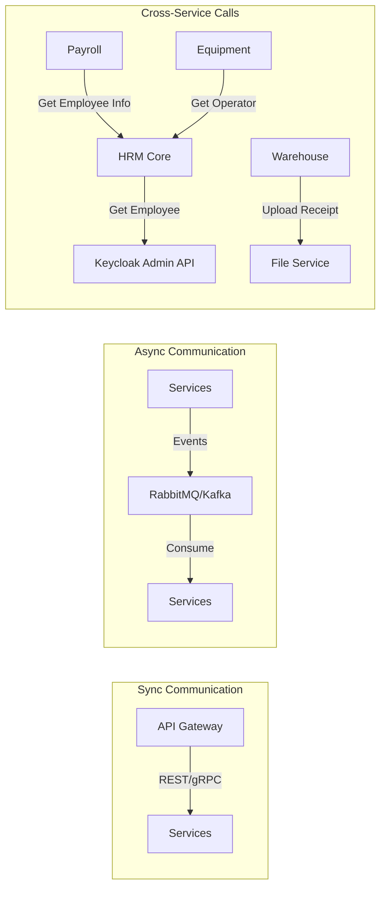

### 2.2 Authentication Flow

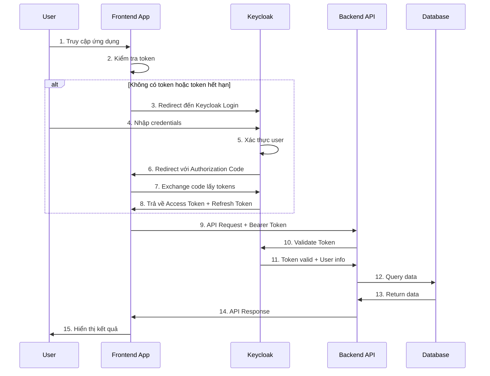

---

## 3. Thiết kế Keycloak

### 3.1 Cấu trúc Realm

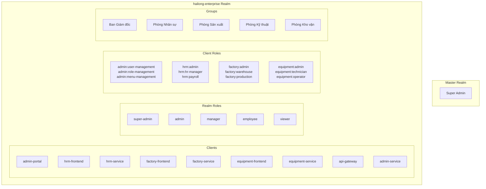

### 3.2 Chi tiết Clients Configuration

#### 3.2.1 Frontend Clients (Public)

| Thuộc tính | hrm-frontend | factory-frontend | equipment-frontend |
|------------|--------------|------------------|-------------------|
| Client ID | `hrm-frontend` | `factory-frontend` | `equipment-frontend` |
| Client Protocol | openid-connect | openid-connect | openid-connect |
| Access Type | public | public | public |
| Standard Flow | ✅ Enabled | ✅ Enabled | ✅ Enabled |
| Direct Access Grants | ❌ Disabled | ❌ Disabled | ❌ Disabled |
| Valid Redirect URIs | `https://hrm.hailong.vn/*`<br/>`http://localhost:4200/*` | `https://factory.hailong.vn/*`<br/>`http://localhost:4200/*` | `https://equipment.hailong.vn/*`<br/>`http://localhost:4200/*` |
| Web Origins | `+` | `+` | `+` |

#### 3.2.2 Backend Clients (Confidential)

| Thuộc tính | hrm-service | factory-service | equipment-service |
|------------|-------------|-----------------|-------------------|
| Client ID | `hrm-service` | `factory-service` | `equipment-service` |
| Client Protocol | openid-connect | openid-connect | openid-connect |
| Access Type | confidential | confidential | confidential |
| Service Accounts | ✅ Enabled | ✅ Enabled | ✅ Enabled |
| Authorization | ✅ Enabled | ✅ Enabled | ✅ Enabled |

### 3.3 Roles Matrix

#### 3.3.1 Realm Roles (Cross-system)

| Role | Mô tả | Quyền |
|------|-------|-------|
| `super-admin` | Quản trị toàn hệ thống | Toàn quyền trên tất cả hệ thống |
| `admin` | Quản trị viên | Quản lý users, roles trong realm |
| `manager` | Quản lý | Xem báo cáo, phê duyệt |
| `employee` | Nhân viên | Quyền cơ bản |
| `viewer` | Chỉ xem | Chỉ có quyền đọc |

#### 3.3.2 Client Roles - HRM System

| Role | Mô tả | Quyền chi tiết |
|------|-------|---------------|
| `hrm:admin` | Admin HRM | Toàn quyền module HRM |
| `hrm:hr-manager` | Quản lý nhân sự | CRUD nhân viên, hợp đồng |
| `hrm:payroll-manager` | Quản lý lương | Xem/sửa bảng lương |
| `hrm:timekeeper` | Chấm công | Quản lý chấm công |
| `hrm:self-service` | Nhân viên | Xem thông tin cá nhân |

#### 3.3.3 Client Roles - Factory System

| Role | Mô tả | Quyền chi tiết |
|------|-------|---------------|
| `factory:admin` | Admin Factory | Toàn quyền module Factory |
| `factory:warehouse-manager` | Quản lý kho | CRUD phiếu xuất/nhập |
| `factory:production-manager` | Quản lý sản xuất | Quản lý lệnh sản xuất |
| `factory:inventory-clerk` | Nhân viên kho | Nhập liệu, báo cáo tồn kho |
| `factory:viewer` | Chỉ xem | Xem báo cáo |

#### 3.3.4 Client Roles - Equipment System

| Role | Mô tả | Quyền chi tiết |
|------|-------|---------------|
| `equipment:admin` | Admin Equipment | Toàn quyền module Equipment |
| `equipment:asset-manager` | Quản lý tài sản | CRUD tài sản, máy móc |
| `equipment:maintenance-manager` | Quản lý bảo trì | Lập lịch, theo dõi bảo trì |
| `equipment:technician` | Kỹ thuật viên | Thực hiện bảo trì |
| `equipment:operator` | Vận hành | Báo cáo sự cố |

### 3.4 Groups & Default Roles

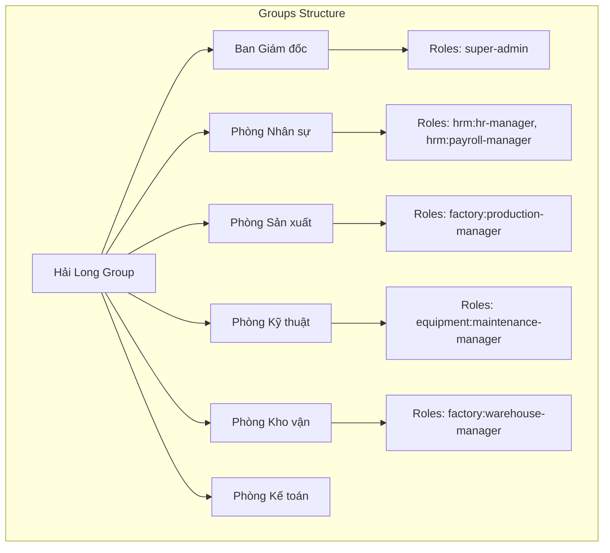

---

## 4. Admin Portal - Quản lý Phân quyền Tập trung

### 4.1 Tổng quan Admin Portal

Admin Portal là một **ứng dụng frontend riêng biệt** dành cho quản trị viên để quản lý:
- 👥 **Users** - Quản lý người dùng trên toàn hệ thống
- 🎭 **Roles** - Phân quyền cho từng phần mềm
- 📋 **Menu Permissions** - Quản lý quyền truy cập menu cho từng ứng dụng
- 🏢 **Organizations** - Quản lý cấu trúc tổ chức, phòng ban

### 4.2 Kiến trúc Admin Portal

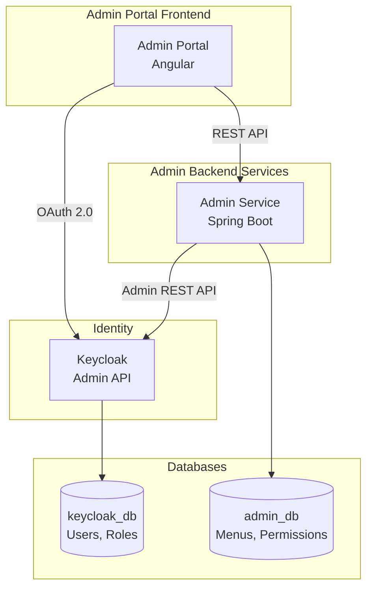

### 4.3 Chức năng chính

#### 4.3.1 User Management

| Chức năng | Mô tả | API |
|-----------|-------|-----|
| Danh sách users | Xem tất cả users trong realm | `GET /admin/users` |
| Tạo user | Tạo user mới trên Keycloak | `POST /admin/users` |
| Sửa user | Cập nhật thông tin user | `PUT /admin/users/{id}` |
| Xóa/Disable user | Vô hiệu hóa tài khoản | `DELETE /admin/users/{id}` |
| Reset password | Đặt lại mật khẩu | `POST /admin/users/{id}/reset-password` |
| Assign roles | Gán roles cho user | `POST /admin/users/{id}/roles` |
| Assign groups | Thêm user vào phòng ban | `POST /admin/users/{id}/groups` |

#### 4.3.2 Role Management

| Chức năng | Mô tả | API |
|-----------|-------|-----|
| Danh sách roles | Xem realm roles & client roles | `GET /admin/roles` |
| Tạo role | Tạo role mới | `POST /admin/roles` |
| Sửa role | Cập nhật role | `PUT /admin/roles/{name}` |
| Xóa role | Xóa role | `DELETE /admin/roles/{name}` |
| Composite roles | Nhóm nhiều roles | `POST /admin/roles/{name}/composites` |

#### 4.3.3 Menu Permission Management

> [!IMPORTANT]
> Menu permissions được quản lý riêng trong `admin_db`, KHÔNG phải trong Keycloak. Điều này cho phép quản lý granular đến từng menu item.

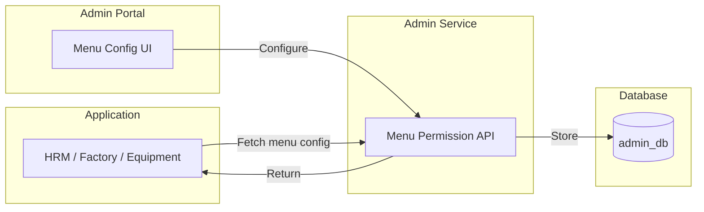

### 4.4 Thiết kế Menu Permission System

#### 4.4.1 Database Schema (PostgreSQL - admin_db)

```sql
-- Bảng Applications (Các phần mềm trong hệ thống)
CREATE TABLE applications (
    id UUID PRIMARY KEY DEFAULT gen_random_uuid(),
    code VARCHAR(50) UNIQUE NOT NULL,  -- 'hrm', 'factory', 'equipment'
    name VARCHAR(100) NOT NULL,
    description TEXT,
    base_url VARCHAR(255),
    icon VARCHAR(50),
    sort_order INT DEFAULT 0,
    is_active BOOLEAN DEFAULT true,
    created_at TIMESTAMP DEFAULT CURRENT_TIMESTAMP,
    updated_at TIMESTAMP DEFAULT CURRENT_TIMESTAMP
);

-- Bảng Menu Items (Các menu trong mỗi ứng dụng)
CREATE TABLE menu_items (
    id UUID PRIMARY KEY DEFAULT gen_random_uuid(),
    application_id UUID REFERENCES applications(id),
    parent_id UUID REFERENCES menu_items(id),  -- Null = root menu
    code VARCHAR(100) NOT NULL,                -- 'hrm.employees', 'hrm.employees.list'
    name VARCHAR(100) NOT NULL,                -- 'Quản lý nhân viên'
    path VARCHAR(255),                         -- '/employees'
    icon VARCHAR(50),
    sort_order INT DEFAULT 0,
    menu_type VARCHAR(20) DEFAULT 'MENU',      -- 'MENU', 'SUBMENU', 'ACTION'
    is_active BOOLEAN DEFAULT true,
    created_at TIMESTAMP DEFAULT CURRENT_TIMESTAMP,
    updated_at TIMESTAMP DEFAULT CURRENT_TIMESTAMP,
    UNIQUE(application_id, code)
);

-- Bảng Role-Menu Permissions (Phân quyền menu theo role)
CREATE TABLE role_menu_permissions (
    id UUID PRIMARY KEY DEFAULT gen_random_uuid(),
    role_name VARCHAR(100) NOT NULL,           -- 'hrm:admin', 'factory:warehouse-manager'
    menu_id UUID REFERENCES menu_items(id),
    can_view BOOLEAN DEFAULT false,
    can_create BOOLEAN DEFAULT false,
    can_edit BOOLEAN DEFAULT false,
    can_delete BOOLEAN DEFAULT false,
    can_export BOOLEAN DEFAULT false,
    can_import BOOLEAN DEFAULT false,
    created_at TIMESTAMP DEFAULT CURRENT_TIMESTAMP,
    updated_at TIMESTAMP DEFAULT CURRENT_TIMESTAMP,
    UNIQUE(role_name, menu_id)
);

-- Indexes
CREATE INDEX idx_menu_items_app ON menu_items(application_id);
CREATE INDEX idx_menu_items_parent ON menu_items(parent_id);
CREATE INDEX idx_role_menu_role ON role_menu_permissions(role_name);
CREATE INDEX idx_role_menu_menu ON role_menu_permissions(menu_id);
```

#### 4.4.2 Ví dụ Data

```sql
-- Applications
INSERT INTO applications (code, name, icon) VALUES
('hrm', 'Quản lý Nhân sự', 'people'),
('factory', 'Quản lý Nhà máy', 'factory'),
('equipment', 'Quản lý Máy móc', 'build');

-- HRM Menu Items
INSERT INTO menu_items (application_id, code, name, path, icon, sort_order) VALUES
-- Level 1
((SELECT id FROM applications WHERE code='hrm'), 'hrm.dashboard', 'Dashboard', '/dashboard', 'dashboard', 1),
((SELECT id FROM applications WHERE code='hrm'), 'hrm.employees', 'Nhân viên', '/employees', 'people', 2),
((SELECT id FROM applications WHERE code='hrm'), 'hrm.payroll', 'Bảng lương', '/payroll', 'payments', 3),
((SELECT id FROM applications WHERE code='hrm'), 'hrm.attendance', 'Chấm công', '/attendance', 'schedule', 4),
((SELECT id FROM applications WHERE code='hrm'), 'hrm.leave', 'Nghỉ phép', '/leave', 'event_busy', 5);

-- Level 2 (Submenu)
INSERT INTO menu_items (application_id, parent_id, code, name, path, sort_order) VALUES
((SELECT id FROM applications WHERE code='hrm'), 
 (SELECT id FROM menu_items WHERE code='hrm.employees'), 
 'hrm.employees.list', 'Danh sách NV', '/employees/list', 1),
((SELECT id FROM applications WHERE code='hrm'), 
 (SELECT id FROM menu_items WHERE code='hrm.employees'), 
 'hrm.employees.contracts', 'Hợp đồng', '/employees/contracts', 2);

-- Role Permissions
INSERT INTO role_menu_permissions (role_name, menu_id, can_view, can_create, can_edit, can_delete) VALUES
('hrm:admin', (SELECT id FROM menu_items WHERE code='hrm.employees'), true, true, true, true),
('hrm:hr-manager', (SELECT id FROM menu_items WHERE code='hrm.employees'), true, true, true, false),
('hrm:self-service', (SELECT id FROM menu_items WHERE code='hrm.employees.list'), true, false, false, false);
```

### 4.5 API Endpoints - Admin Service

#### 4.5.1 Menu Configuration APIs

```yaml
# Quản lý Menu
GET    /api/admin/applications                    # Danh sách ứng dụng
POST   /api/admin/applications                    # Tạo ứng dụng mới
GET    /api/admin/applications/{code}/menus       # Lấy menu tree của app
POST   /api/admin/applications/{code}/menus       # Tạo menu item
PUT    /api/admin/menus/{id}                      # Cập nhật menu
DELETE /api/admin/menus/{id}                      # Xóa menu

# Phân quyền menu cho role
GET    /api/admin/roles/{roleName}/menu-permissions    # Xem quyền menu của role
PUT    /api/admin/roles/{roleName}/menu-permissions    # Cập nhật quyền menu
POST   /api/admin/roles/{roleName}/menu-permissions/batch  # Batch update

# API cho Frontend Apps (để load menu)
GET    /api/menu/my-permissions                   # Lấy menu permissions của user hiện tại
GET    /api/menu/applications/{code}/accessible   # Lấy menu user có quyền access
```

#### 4.5.2 Response Format

```json
// GET /api/menu/applications/hrm/accessible
{
  "applicationCode": "hrm",
  "applicationName": "Quản lý Nhân sự",
  "menus": [
    {
      "id": "uuid",
      "code": "hrm.employees",
      "name": "Nhân viên",
      "path": "/employees",
      "icon": "people",
      "permissions": {
        "canView": true,
        "canCreate": true,
        "canEdit": true,
        "canDelete": false,
        "canExport": true,
        "canImport": false
      },
      "children": [
        {
          "id": "uuid",
          "code": "hrm.employees.list",
          "name": "Danh sách NV",
          "path": "/employees/list",
          "permissions": { ... }
        }
      ]
    }
  ]
}
```

### 4.6 Admin Portal UI Mockup

```
┌─────────────────────────────────────────────────────────────────────────────┐
│  🏢 Hải Long Admin Portal                          👤 admin@hailong.vn  ▼  │
├─────────────────────────────────────────────────────────────────────────────┤
│                                                                             │
│  ┌─────────────┐                                                            │
│  │ 📋 Menu     │   ┌─────────────────────────────────────────────────────┐  │
│  │             │   │  Phân quyền Menu - HRM System                       │  │
│  │ • Dashboard │   ├─────────────────────────────────────────────────────┤  │
│  │ • Users     │   │                                                     │  │
│  │ • Roles     │   │  Role: [hrm:hr-manager          ▼]                  │  │
│  │ • Groups    │   │                                                     │  │
│  │ • Menus  ◄──│   │  ┌──────────────────────────────────────────────┐  │  │
│  │ • Apps      │   │  │ Menu Item          View  Add  Edit  Del  Exp │  │  │
│  │ • Audit Log │   │  ├──────────────────────────────────────────────┤  │  │
│  │             │   │  │ 📊 Dashboard        ☑    ☐    ☐    ☐    ☑   │  │  │
│  └─────────────┘   │  │ 👥 Nhân viên        ☑    ☑    ☑    ☐    ☑   │  │  │
│                    │  │   ├─ Danh sách NV   ☑    ☑    ☑    ☐    ☑   │  │  │
│                    │  │   ├─ Hợp đồng       ☑    ☑    ☑    ☐    ☐   │  │  │
│                    │  │   └─ Hồ sơ          ☑    ☐    ☐    ☐    ☐   │  │  │
│                    │  │ 💰 Bảng lương       ☑    ☐    ☐    ☐    ☑   │  │  │
│                    │  │ ⏰ Chấm công        ☑    ☑    ☑    ☐    ☑   │  │  │
│                    │  │ 🏖️ Nghỉ phép        ☑    ☑    ☑    ☑    ☐   │  │  │
│                    │  └──────────────────────────────────────────────┘  │  │
│                    │                                                     │  │
│                    │  [💾 Lưu thay đổi]  [↩️ Hủy]                         │  │
│                    └─────────────────────────────────────────────────────┘  │
└─────────────────────────────────────────────────────────────────────────────┘
```

### 4.7 Frontend Integration - Load Menu từ Admin Service

```typescript
// menu.service.ts
@Injectable({ providedIn: 'root' })
export class MenuService {
  constructor(private http: HttpClient) {}

  getAccessibleMenus(appCode: string): Observable<MenuResponse> {
    return this.http.get<MenuResponse>(
      `${environment.adminServiceUrl}/api/menu/applications/${appCode}/accessible`
    );
  }
}

// app.component.ts
export class AppComponent implements OnInit {
  menuItems: MenuItem[] = [];
  
  constructor(
    private menuService: MenuService,
    private keycloak: KeycloakService
  ) {}
  
  ngOnInit() {
    if (this.keycloak.isLoggedIn()) {
      this.menuService.getAccessibleMenus('hrm').subscribe(response => {
        this.menuItems = response.menus;
      });
    }
  }
}

// Template với permission check
// <button *ngIf="menu.permissions.canCreate" (click)="create()">Thêm mới</button>
// <button *ngIf="menu.permissions.canExport" (click)="export()">Xuất Excel</button>
```

### 4.8 Tổng hợp Services sau khi thêm Admin Portal

| Domain | Service | Database | Chức năng |
|--------|---------|----------|-----------|
| **Admin** | Admin Portal (FE) | - | UI quản trị |
| **Admin** | Admin Service (BE) | PostgreSQL (admin_db) | APIs quản lý menu, sync Keycloak |
| **Identity** | Keycloak | PostgreSQL (keycloak_db) | Auth, Users, Roles |
| **HRM** | HRM Core + Payroll | PostgreSQL (hrm_db) | Nhân sự, Lương |
| **Factory** | Warehouse Service | MongoDB (factory_db) | Kho, Sản xuất |
| **Equipment** | Equipment Service | PostgreSQL (equipment_db) | Tài sản, Bảo trì |
| **Shared** | File Service | MongoDB (file_db) | Files, Documents |
| **Shared** | Notification Service | - (stateless) | Email, SMS |

**Tổng: 8 services + Keycloak**

---

## 5. Thiết kế API Security

### 4.1 Spring Security Configuration

```java
// Cấu hình chung cho tất cả services
@Configuration
@EnableWebSecurity
@EnableMethodSecurity
public class SecurityConfig {
    
    @Bean
    public SecurityFilterChain filterChain(HttpSecurity http) throws Exception {
        http
            .cors(cors -> cors.configurationSource(corsConfigurationSource()))
            .csrf(csrf -> csrf.disable())
            .sessionManagement(session -> 
                session.sessionCreationPolicy(SessionCreationPolicy.STATELESS))
            .authorizeHttpRequests(auth -> auth
                .requestMatchers("/actuator/health", "/api/public/**").permitAll()
                .requestMatchers("/api/admin/**").hasRole("ADMIN")
                .anyRequest().authenticated()
            )
            .oauth2ResourceServer(oauth2 -> oauth2
                .jwt(jwt -> jwt.jwtAuthenticationConverter(jwtAuthConverter()))
            );
        return http.build();
    }
    
    @Bean
    public JwtAuthenticationConverter jwtAuthConverter() {
        JwtGrantedAuthoritiesConverter grantedAuthoritiesConverter = 
            new JwtGrantedAuthoritiesConverter();
        grantedAuthoritiesConverter.setAuthoritiesClaimName("roles");
        grantedAuthoritiesConverter.setAuthorityPrefix("ROLE_");
        
        JwtAuthenticationConverter jwtConverter = new JwtAuthenticationConverter();
        jwtConverter.setJwtGrantedAuthoritiesConverter(grantedAuthoritiesConverter);
        return jwtConverter;
    }
}
```

### 4.2 Custom Role Converter

```java
// Converter để map Keycloak roles sang Spring Security authorities
public class KeycloakRealmRoleConverter implements Converter<Jwt, Collection<GrantedAuthority>> {
    
    @Override
    public Collection<GrantedAuthority> convert(Jwt jwt) {
        List<GrantedAuthority> authorities = new ArrayList<>();
        
        // Extract realm roles
        Map<String, Object> realmAccess = jwt.getClaim("realm_access");
        if (realmAccess != null) {
            List<String> roles = (List<String>) realmAccess.get("roles");
            roles.forEach(role -> 
                authorities.add(new SimpleGrantedAuthority("ROLE_" + role.toUpperCase())));
        }
        
        // Extract client roles
        Map<String, Object> resourceAccess = jwt.getClaim("resource_access");
        if (resourceAccess != null) {
            resourceAccess.forEach((clientId, access) -> {
                Map<String, Object> clientAccess = (Map<String, Object>) access;
                List<String> clientRoles = (List<String>) clientAccess.get("roles");
                if (clientRoles != null) {
                    clientRoles.forEach(role -> 
                        authorities.add(new SimpleGrantedAuthority(
                            "ROLE_" + clientId.toUpperCase() + "_" + role.toUpperCase())));
                }
            });
        }
        
        return authorities;
    }
}
```

### 4.3 Method Level Security

```java
@RestController
@RequestMapping("/api/employees")
public class EmployeeController {
    
    @GetMapping
    @PreAuthorize("hasAnyRole('HRM_ADMIN', 'HRM_HR-MANAGER', 'ADMIN')")
    public List<Employee> getAllEmployees() { ... }
    
    @PostMapping
    @PreAuthorize("hasRole('HRM_ADMIN')")
    public Employee createEmployee(@RequestBody EmployeeDTO dto) { ... }
    
    @GetMapping("/me")
    @PreAuthorize("hasRole('HRM_SELF-SERVICE')")
    public Employee getCurrentEmployee(@AuthenticationPrincipal Jwt jwt) {
        String userId = jwt.getSubject();
        return employeeService.findByKeycloakId(userId);
    }
}
```

---

## 5. Frontend Integration

### 5.1 Angular Integration với keycloak-angular

```typescript
// app.config.ts
import { KeycloakService, KeycloakAngularModule } from 'keycloak-angular';

function initializeKeycloak(keycloak: KeycloakService) {
  return () =>
    keycloak.init({
      config: {
        url: environment.keycloak.url,
        realm: environment.keycloak.realm,
        clientId: environment.keycloak.clientId
      },
      initOptions: {
        onLoad: 'check-sso',
        silentCheckSsoRedirectUri: 
          window.location.origin + '/assets/silent-check-sso.html',
        checkLoginIframe: false
      },
      loadUserProfileAtStartUp: true,
      enableBearerInterceptor: true,
      bearerPrefix: 'Bearer',
      bearerExcludedUrls: ['/assets']
    });
}

export const appConfig: ApplicationConfig = {
  providers: [
    KeycloakAngularModule,
    {
      provide: APP_INITIALIZER,
      useFactory: initializeKeycloak,
      multi: true,
      deps: [KeycloakService]
    }
  ]
};
```

### 5.2 Auth Guard

```typescript
// auth.guard.ts
@Injectable({ providedIn: 'root' })
export class AuthGuard extends KeycloakAuthGuard {
  
  constructor(
    protected router: Router,
    protected keycloakService: KeycloakService
  ) {
    super(router, keycloakService);
  }

  async isAccessAllowed(
    route: ActivatedRouteSnapshot,
    state: RouterStateSnapshot
  ): Promise<boolean> {
    if (!this.authenticated) {
      await this.keycloakService.login({
        redirectUri: window.location.origin + state.url
      });
      return false;
    }

    const requiredRoles = route.data['roles'] as string[];
    if (!requiredRoles || requiredRoles.length === 0) {
      return true;
    }

    return requiredRoles.some(role => this.roles.includes(role));
  }
}
```

### 5.3 Role-based UI Components

```typescript
// has-role.directive.ts
@Directive({ selector: '[appHasRole]' })
export class HasRoleDirective implements OnInit {
  @Input('appHasRole') roles: string[] = [];

  constructor(
    private templateRef: TemplateRef<any>,
    private viewContainer: ViewContainerRef,
    private keycloakService: KeycloakService
  ) {}

  ngOnInit(): void {
    const userRoles = this.keycloakService.getUserRoles();
    const hasRole = this.roles.some(role => userRoles.includes(role));
    
    if (hasRole) {
      this.viewContainer.createEmbeddedView(this.templateRef);
    } else {
      this.viewContainer.clear();
    }
  }
}

// Usage in template
// <button *appHasRole="['hrm:admin', 'hrm:hr-manager']">Thêm nhân viên</button>
```

---

## 6. User Synchronization Strategy

### 6.1 Strategy Overview

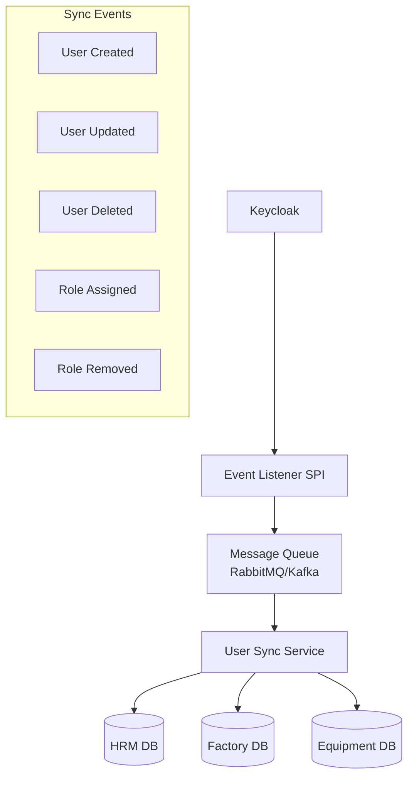

### 6.2 Keycloak Event Listener

```java
public class UserSyncEventListenerProvider implements EventListenerProvider {
    
    private final RabbitTemplate rabbitTemplate;
    
    @Override
    public void onEvent(Event event) {
        if (event.getType() == EventType.REGISTER || 
            event.getType() == EventType.UPDATE_PROFILE) {
            
            UserSyncEvent syncEvent = new UserSyncEvent(
                event.getUserId(),
                event.getType().name(),
                event.getDetails()
            );
            rabbitTemplate.convertAndSend("user-sync-exchange", "user.updated", syncEvent);
        }
    }
    
    @Override
    public void onEvent(AdminEvent event, boolean includeRepresentation) {
        if (event.getResourceType() == ResourceType.USER) {
            UserSyncEvent syncEvent = new UserSyncEvent(
                extractUserId(event.getResourcePath()),
                event.getOperationType().name(),
                event.getRepresentation()
            );
            rabbitTemplate.convertAndSend("user-sync-exchange", "user.admin", syncEvent);
        }
    }
}
```

### 6.3 User Entity Mapping

```java
// Base User entity for all services
@Document(collection = "users")
public class User {
    @Id
    private String id;
    
    @Indexed(unique = true)
    private String keycloakId;  // UUID from Keycloak
    
    @Indexed(unique = true)
    private String username;
    
    private String email;
    private String firstName;
    private String lastName;
    private String fullName;
    private String phoneNumber;
    private String department;
    private String employeeCode;
    
    private Set<String> roles = new HashSet<>();
    private boolean active = true;
    
    private LocalDateTime createdAt;
    private LocalDateTime updatedAt;
    private String createdBy;
    private String updatedBy;
}
```

---

## 7. Infrastructure & Deployment

### 7.1 Docker Compose Configuration

```yaml
version: '3.8'

services:
  keycloak:
    image: quay.io/keycloak/keycloak:24.0
    container_name: keycloak
    environment:
      KC_DB: postgres
      KC_DB_URL: jdbc:postgresql://keycloak-db:5432/keycloak
      KC_DB_USERNAME: keycloak
      KC_DB_PASSWORD: ${KC_DB_PASSWORD}
      KC_HOSTNAME: auth.hailong.vn
      KC_HOSTNAME_STRICT: false
      KC_HTTP_ENABLED: true
      KC_PROXY: edge
      KEYCLOAK_ADMIN: admin
      KEYCLOAK_ADMIN_PASSWORD: ${KC_ADMIN_PASSWORD}
    command: start
    ports:
      - "8180:8080"
    depends_on:
      - keycloak-db
    networks:
      - hailong-network

  keycloak-db:
    image: postgres:15-alpine
    container_name: keycloak-db
    environment:
      POSTGRES_DB: keycloak
      POSTGRES_USER: keycloak
      POSTGRES_PASSWORD: ${KC_DB_PASSWORD}
    volumes:
      - keycloak_db_data:/var/lib/postgresql/data
    networks:
      - hailong-network

  api-gateway:
    image: hailong/api-gateway:latest
    container_name: api-gateway
    environment:
      KEYCLOAK_URL: http://keycloak:8080
      KEYCLOAK_REALM: hailong-enterprise
    ports:
      - "8080:8080"
    networks:
      - hailong-network

volumes:
  keycloak_db_data:

networks:
  hailong-network:
    driver: bridge
```

### 7.2 Environment Configuration

```properties
# application-keycloak.yml cho mỗi service
spring:
  security:
    oauth2:
      resourceserver:
        jwt:
          issuer-uri: ${KEYCLOAK_URL}/realms/${KEYCLOAK_REALM}
          jwk-set-uri: ${KEYCLOAK_URL}/realms/${KEYCLOAK_REALM}/protocol/openid-connect/certs

keycloak:
  url: ${KEYCLOAK_URL:http://localhost:8180}
  realm: ${KEYCLOAK_REALM:hailong-enterprise}
  client-id: ${KEYCLOAK_CLIENT_ID}
  client-secret: ${KEYCLOAK_CLIENT_SECRET}
```

### 7.3 Production Architecture

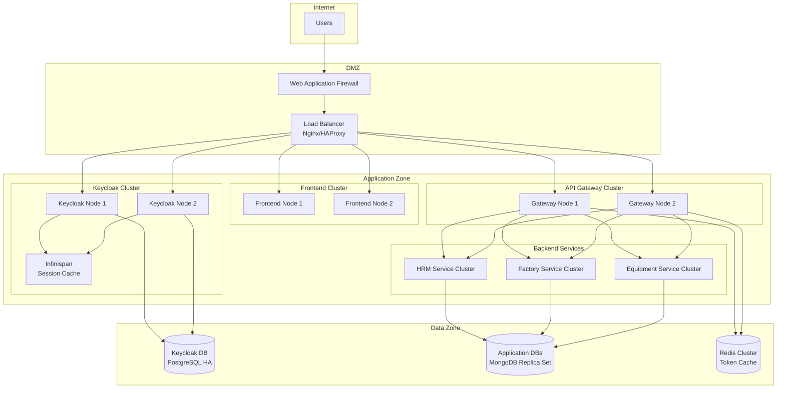

---

## 8. Migration Plan cho Factory System hiện tại

### 8.1 Phân tích hệ thống hiện tại

> [!IMPORTANT]
> Hệ thống Factory hiện tại (`hailong-warehouse`) cần được phân tích kỹ về:
> - Cơ chế authentication hiện tại (JWT tự quản lý, Session-based, etc.)
> - Cấu trúc database users/roles
> - Các API endpoints cần bảo vệ

### 8.2 Các bước Migration

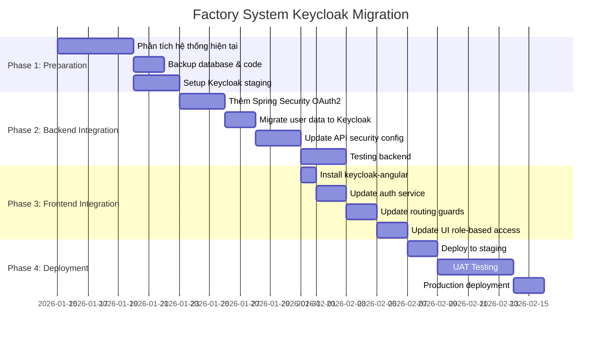

### 8.3 User Data Migration Script

```java
@Service
public class UserMigrationService {
    
    private final Keycloak keycloakAdmin;
    private final UserRepository localUserRepo;
    
    public void migrateUsers() {
        RealmResource realm = keycloakAdmin.realm("hailong-enterprise");
        UsersResource users = realm.users();
        
        localUserRepo.findAll().forEach(localUser -> {
            CredentialRepresentation credential = new CredentialRepresentation();
            credential.setType(CredentialRepresentation.PASSWORD);
            credential.setTemporary(true); // Force password change on first login
            credential.setValue("ChangeMe@123");
            
            UserRepresentation keycloakUser = new UserRepresentation();
            keycloakUser.setUsername(localUser.getUsername());
            keycloakUser.setEmail(localUser.getEmail());
            keycloakUser.setFirstName(localUser.getFirstName());
            keycloakUser.setLastName(localUser.getLastName());
            keycloakUser.setEnabled(true);
            keycloakUser.setEmailVerified(true);
            keycloakUser.setCredentials(List.of(credential));
            
            // Set attributes
            Map<String, List<String>> attributes = new HashMap<>();
            attributes.put("employeeCode", List.of(localUser.getEmployeeCode()));
            attributes.put("department", List.of(localUser.getDepartment()));
            keycloakUser.setAttributes(attributes);
            
            Response response = users.create(keycloakUser);
            if (response.getStatus() == 201) {
                String userId = getCreatedId(response);
                assignRoles(realm, userId, localUser.getRoles());
                
                // Update local user with Keycloak ID
                localUser.setKeycloakId(userId);
                localUserRepo.save(localUser);
            }
        });
    }
}
```

---

## 9. Security Best Practices

### 9.1 Token Configuration

| Setting | Development | Production |
|---------|-------------|------------|
| Access Token Lifespan | 15 minutes | 5 minutes |
| Refresh Token Lifespan | 30 days | 8 hours |
| SSO Session Idle | 30 minutes | 15 minutes |
| SSO Session Max | 10 hours | 8 hours |
| Client Session Idle | 30 minutes | 15 minutes |

### 9.2 Password Policy

```
- Minimum length: 8 characters
- Uppercase: Required
- Lowercase: Required
- Digits: Required
- Special characters: Required
- Not username: Enabled
- Password history: 5 passwords
- Expiration: 90 days
```

### 9.3 Brute Force Protection

```yaml
# Keycloak Brute Force Detection
bruteForceProtection:
  enabled: true
  permanentLockout: false
  maxFailureWaitSeconds: 900
  minimumQuickLoginWaitSeconds: 60
  waitIncrementSeconds: 60
  quickLoginCheckMilliSeconds: 1000
  maxDeltaTimeSeconds: 43200
  failureFactor: 5
```

---

## 10. Monitoring & Logging

### 10.1 Metrics to Monitor

| Metric | Mô tả | Alert Threshold |
|--------|-------|-----------------|
| `keycloak_logins_total` | Tổng số login | - |
| `keycloak_login_errors_total` | Số login thất bại | > 100/hour |
| `keycloak_request_duration_seconds` | Thời gian response | > 2s (p99) |
| `keycloak_registrations_total` | Số đăng ký mới | - |
| `keycloak_active_sessions` | Sessions đang hoạt động | > 10000 |

### 10.2 Audit Events

```java
// Cấu hình audit logging
@Configuration
public class AuditConfig {
    
    @Bean
    public AuditEventRepository auditEventRepository() {
        return new CustomAuditEventRepository();
    }
}

// Events cần log
// - AUTHENTICATION_SUCCESS
// - AUTHENTICATION_FAILURE
// - AUTHORIZATION_FAILURE
// - USER_CREATED
// - USER_UPDATED
// - ROLE_ASSIGNED
// - ROLE_REMOVED
```

---

## 11. Kế hoạch Triển khai

### 11.1 Timeline

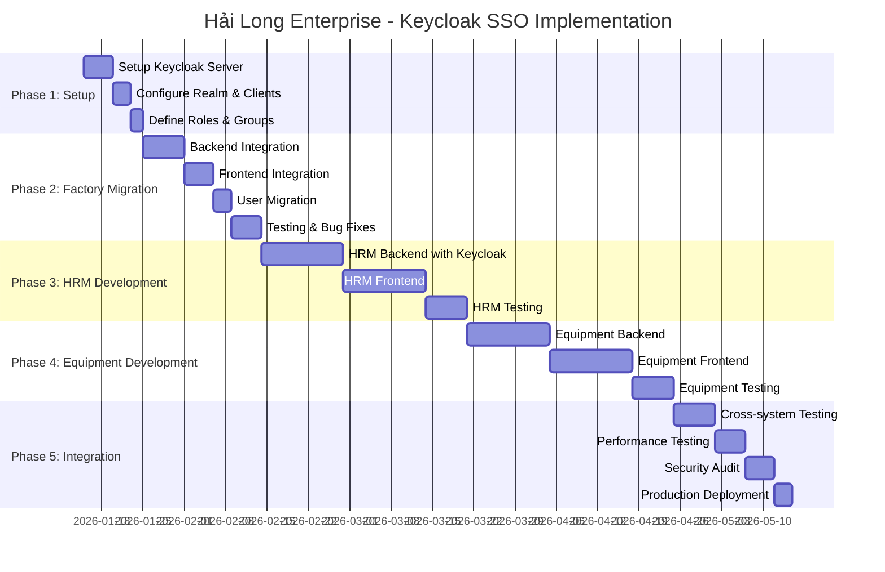

### 11.2 Resource Estimation

| Phase | Duration | Team |
|-------|----------|------|
| Phase 1: Setup | 2 tuần | 1 DevOps, 1 Backend |
| Phase 2: Factory Migration | 4 tuần | 2 Backend, 1 Frontend |
| Phase 3: HRM Development | 5 tuần | 2 Backend, 2 Frontend |
| Phase 4: Equipment Development | 5 tuần | 2 Backend, 2 Frontend |
| Phase 5: Integration | 3 tuần | Full team |
| **Total** | **~19 tuần** | |

---

## 12. Rủi ro và Giải pháp

| Rủi ro | Mức độ | Giải pháp |
|--------|--------|-----------|
| Downtime khi migrate Factory | Cao | Blue-green deployment, migrate ngoài giờ |
| User quên mật khẩu mới | Trung bình | Email thông báo trước, hỗ trợ reset |
| Performance degradation | Trung bình | Caching, connection pooling, monitoring |
| Keycloak single point of failure | Cao | HA cluster với 2+ nodes |
| Token theft | Cao | Short token lifetime, HTTPS only, secure cookies |

---

## 13. Checklist Hoàn thành

- [ ] Keycloak server deployed và configured
- [ ] Realm `hailong-enterprise` created
- [ ] All clients configured (6 clients)
- [ ] Roles hierarchy định nghĩa
- [ ] Groups structure thiết lập
- [ ] Factory backend integrated
- [ ] Factory frontend integrated
- [ ] User migration completed
- [ ] HRM module developed
- [ ] Equipment module developed
- [ ] Cross-system SSO tested
- [ ] Security audit passed
- [ ] Production deployment completed
- [ ] Documentation finalized

---

## Phụ lục

### A. Keycloak Admin CLI Commands

```bash
# Login to admin CLI
./kcadm.sh config credentials --server http://localhost:8180 \
  --realm master --user admin --password admin

# Create realm
./kcadm.sh create realms -s realm=hailong-enterprise -s enabled=true

# Create client
./kcadm.sh create clients -r hailong-enterprise \
  -s clientId=factory-frontend \
  -s publicClient=true \
  -s 'redirectUris=["https://factory.hailong.vn/*"]'

# Create role
./kcadm.sh create roles -r hailong-enterprise -s name=admin

# Create user
./kcadm.sh create users -r hailong-enterprise \
  -s username=testuser \
  -s enabled=true \
  -s email=test@hailong.vn
```

### B. Useful API Endpoints

| Endpoint | Mô tả |
|----------|-------|
| `GET /realms/{realm}/.well-known/openid-configuration` | OpenID Config |
| `POST /realms/{realm}/protocol/openid-connect/token` | Get Token |
| `GET /realms/{realm}/protocol/openid-connect/userinfo` | User Info |
| `POST /realms/{realm}/protocol/openid-connect/logout` | Logout |
| `GET /realms/{realm}/protocol/openid-connect/certs` | JWKS |

---

*Tài liệu này được tạo ngày 08/01/2026*
*Version: 1.0*
*Author: AI Assistant*
