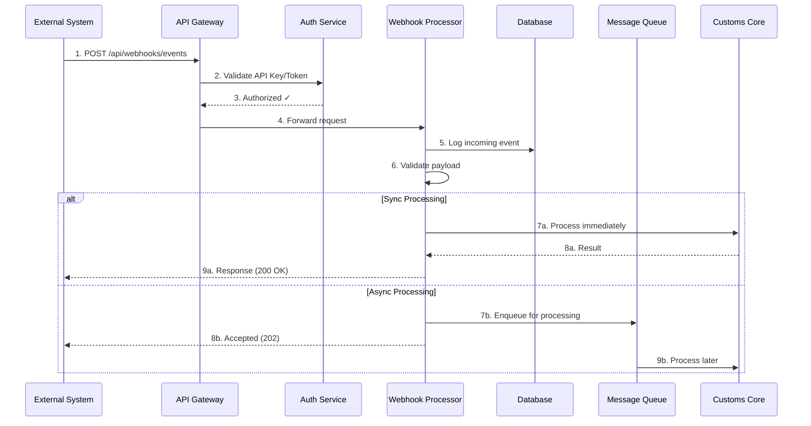
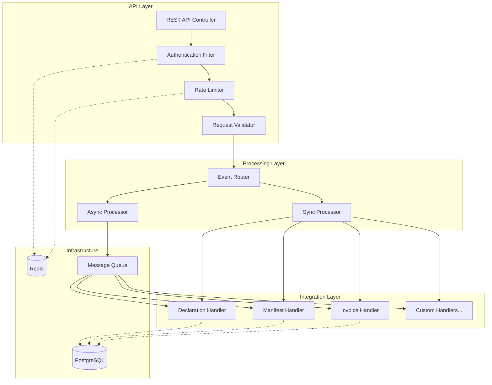
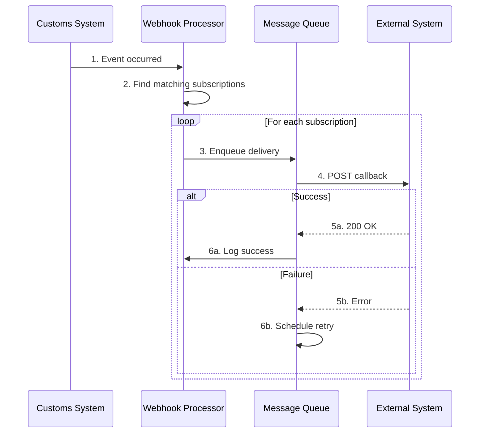

# Tài liệu Thiết kế: Customs Webhook Gateway

> **Hệ thống Webhook Hub cho Hải Quan (Customs)**  
> Cho phép các hệ thống bên ngoài đăng ký, gửi và nhận events thông qua Customs API Gateway

---

## 1. Tổng quan

### 1.1 Mục tiêu

Thiết kế một **Webhook Gateway** cho hệ thống Hải Quan (Customs) với vai trò:
- **Hub trung tâm** nhận events từ các hệ thống bên ngoài
- **Cung cấp Open API** để systems khác integrate
- **Đảm bảo reliability** với retry, logging, monitoring
- **Scale horizontally** khi số lượng external systems tăng

### 1.2 Mô hình kiến trúc

```
┌────────────────────────────────────────────────────────────────────────┐
│                         EXTERNAL SYSTEMS                                │
│  ┌──────────┐  ┌──────────┐  ┌──────────┐  ┌──────────┐               │
│  │ ERP      │  │ WMS      │  │ TMS      │  │ Partner  │  ...          │
│  │ System   │  │ System   │  │ System   │  │ System   │               │
│  └────┬─────┘  └────┬─────┘  └────┬─────┘  └────┬─────┘               │
│       │ POST        │ POST        │ POST        │ POST                 │
└───────┼─────────────┼─────────────┼─────────────┼──────────────────────┘
        │             │             │             │
        ▼             ▼             ▼             ▼
┌────────────────────────────────────────────────────────────────────────┐
│                    CUSTOMS WEBHOOK GATEWAY                              │
│  ┌──────────────────────────────────────────────────────────────────┐  │
│  │  API Gateway Layer                                                │  │
│  │  • Authentication (API Key, OAuth2, HMAC)                        │  │
│  │  • Rate Limiting                                                  │  │
│  │  • Request Validation                                             │  │
│  └──────────────────────────────────────────────────────────────────┘  │
│                               │                                         │
│                               ▼                                         │
│  ┌──────────────────────────────────────────────────────────────────┐  │
│  │  Webhook Processor                                                │  │
│  │  • Event Routing                                                  │  │
│  │  • Business Logic                                                 │  │
│  │  • Response Handling                                              │  │
│  └──────────────────────────────────────────────────────────────────┘  │
│                               │                                         │
│                               ▼                                         │
│  ┌──────────────────────────────────────────────────────────────────┐  │
│  │  Data Layer                                                       │  │
│  │  • PostgreSQL (Client configs, audit logs)                       │  │
│  │  • Redis (Rate limiting, caching)                                │  │
│  │  • Message Queue (Async processing)                              │  │
│  └──────────────────────────────────────────────────────────────────┘  │
└────────────────────────────────────────────────────────────────────────┘
```

---

## 2. Kiến trúc Chi tiết

### 2.1 High-Level Flow



### 2.2 Component Architecture



---

## 3. Data Model

### 3.1 Database Schema

```sql
-- =====================================================
-- 1. WEBHOOK CLIENTS - External systems registration
-- =====================================================
CREATE TABLE webhook_clients (
    id UUID PRIMARY KEY DEFAULT gen_random_uuid(),
    
    -- Client identification
    client_code VARCHAR(50) UNIQUE NOT NULL,
    client_name VARCHAR(200) NOT NULL,
    description TEXT,
    
    -- Contact info
    contact_email VARCHAR(255),
    contact_phone VARCHAR(50),
    organization VARCHAR(200),
    
    -- Authentication
    api_key VARCHAR(100) UNIQUE NOT NULL,  -- Hashed
    api_secret VARCHAR(255),                -- Encrypted (for HMAC)
    auth_type VARCHAR(20) DEFAULT 'API_KEY', -- API_KEY, HMAC, OAUTH2
    
    -- Permissions & Limits
    allowed_event_types TEXT[],             -- ['declaration.*', 'manifest.created']
    rate_limit_per_minute INT DEFAULT 60,
    is_active BOOLEAN DEFAULT true,
    
    -- Metadata
    created_at TIMESTAMP DEFAULT CURRENT_TIMESTAMP,
    updated_at TIMESTAMP DEFAULT CURRENT_TIMESTAMP,
    expires_at TIMESTAMP,                   -- Optional expiry
    created_by VARCHAR(100)
);

CREATE INDEX idx_client_code ON webhook_clients(client_code);
CREATE INDEX idx_client_api_key ON webhook_clients(api_key);
CREATE INDEX idx_client_active ON webhook_clients(is_active);

-- =====================================================
-- 2. WEBHOOK EVENTS - Incoming events log
-- =====================================================
CREATE TABLE webhook_events (
    id UUID PRIMARY KEY DEFAULT gen_random_uuid(),
    
    -- Source
    client_id UUID REFERENCES webhook_clients(id),
    client_code VARCHAR(50) NOT NULL,
    
    -- Event info
    event_id VARCHAR(100) UNIQUE NOT NULL,  -- Client-provided idempotency key
    event_type VARCHAR(100) NOT NULL,        -- declaration.submitted, manifest.created
    event_version VARCHAR(20) DEFAULT '1.0',
    
    -- Payload
    payload JSONB NOT NULL,
    payload_size_bytes INT,
    
    -- Processing
    status VARCHAR(20) DEFAULT 'RECEIVED',   -- RECEIVED, PROCESSING, COMPLETED, FAILED
    processing_mode VARCHAR(20),             -- SYNC, ASYNC
    processed_at TIMESTAMP,
    processing_time_ms INT,
    
    -- Response
    response_code INT,
    response_body JSONB,
    error_message TEXT,
    retry_count INT DEFAULT 0,
    
    -- Request metadata
    request_ip VARCHAR(50),
    request_headers JSONB,
    correlation_id VARCHAR(100),
    
    -- Timestamps
    received_at TIMESTAMP DEFAULT CURRENT_TIMESTAMP,
    created_at TIMESTAMP DEFAULT CURRENT_TIMESTAMP
);

CREATE INDEX idx_event_client ON webhook_events(client_id);
CREATE INDEX idx_event_type ON webhook_events(event_type);
CREATE INDEX idx_event_status ON webhook_events(status);
CREATE INDEX idx_event_received ON webhook_events(received_at);
CREATE INDEX idx_event_idempotency ON webhook_events(event_id);

-- =====================================================
-- 3. EVENT TYPES - Registry of supported events
-- =====================================================
CREATE TABLE webhook_event_types (
    id UUID PRIMARY KEY DEFAULT gen_random_uuid(),
    
    event_type VARCHAR(100) UNIQUE NOT NULL,
    category VARCHAR(50) NOT NULL,
    description TEXT,
    
    -- Schema
    payload_schema JSONB,                    -- JSON Schema for validation
    sample_payload JSONB,
    
    -- Processing config
    processing_mode VARCHAR(20) DEFAULT 'ASYNC',  -- SYNC, ASYNC
    handler_class VARCHAR(200),
    timeout_seconds INT DEFAULT 30,
    
    is_active BOOLEAN DEFAULT true,
    created_at TIMESTAMP DEFAULT CURRENT_TIMESTAMP
);

-- =====================================================
-- 4. OUTBOUND WEBHOOKS - Callbacks to external systems
-- =====================================================
CREATE TABLE webhook_subscriptions (
    id UUID PRIMARY KEY DEFAULT gen_random_uuid(),
    
    client_id UUID REFERENCES webhook_clients(id),
    
    -- Subscription config
    name VARCHAR(100) NOT NULL,
    target_url VARCHAR(500) NOT NULL,
    http_method VARCHAR(10) DEFAULT 'POST',
    headers JSONB DEFAULT '{}',
    
    -- Event filtering
    event_types TEXT[] NOT NULL,
    filter_conditions JSONB,
    
    -- Delivery settings
    timeout_seconds INT DEFAULT 30,
    max_retries INT DEFAULT 5,
    
    status VARCHAR(20) DEFAULT 'ACTIVE',
    created_at TIMESTAMP DEFAULT CURRENT_TIMESTAMP,
    updated_at TIMESTAMP DEFAULT CURRENT_TIMESTAMP
);

-- =====================================================
-- 5. DELIVERY LOGS - Outbound webhook deliveries
-- =====================================================
CREATE TABLE webhook_delivery_logs (
    id UUID PRIMARY KEY DEFAULT gen_random_uuid(),
    
    subscription_id UUID REFERENCES webhook_subscriptions(id),
    event_id UUID REFERENCES webhook_events(id),
    
    -- Delivery details
    target_url VARCHAR(500),
    request_body JSONB,
    request_headers JSONB,
    
    -- Response
    response_status INT,
    response_body TEXT,
    response_time_ms INT,
    
    -- Status
    delivery_status VARCHAR(20) NOT NULL,    -- PENDING, SUCCESS, FAILED, RETRYING
    attempt_number INT DEFAULT 1,
    error_message TEXT,
    next_retry_at TIMESTAMP,
    
    created_at TIMESTAMP DEFAULT CURRENT_TIMESTAMP
);

CREATE INDEX idx_delivery_status ON webhook_delivery_logs(delivery_status);
CREATE INDEX idx_delivery_subscription ON webhook_delivery_logs(subscription_id);
```

### 3.2 Event Types Registry (Example Data)

```sql
INSERT INTO webhook_event_types (event_type, category, description, processing_mode) VALUES
-- Declaration events
('declaration.submitted', 'declaration', 'Tờ khai được nộp', 'ASYNC'),
('declaration.approved', 'declaration', 'Tờ khai được duyệt', 'ASYNC'),
('declaration.rejected', 'declaration', 'Tờ khai bị từ chối', 'ASYNC'),
('declaration.amended', 'declaration', 'Tờ khai được sửa đổi', 'ASYNC'),

-- Manifest events
('manifest.created', 'manifest', 'Manifest được tạo', 'SYNC'),
('manifest.updated', 'manifest', 'Manifest được cập nhật', 'SYNC'),
('manifest.cancelled', 'manifest', 'Manifest bị hủy', 'ASYNC'),

-- Invoice events
('invoice.submitted', 'invoice', 'Hóa đơn được nộp', 'ASYNC'),
('invoice.validated', 'invoice', 'Hóa đơn được xác thực', 'ASYNC'),

-- Container events
('container.arrived', 'container', 'Container đã đến', 'SYNC'),
('container.released', 'container', 'Container đã thông quan', 'ASYNC'),
('container.inspected', 'container', 'Container đã kiểm tra', 'ASYNC');
```

---

## 4. API Design

### 4.1 Core Endpoints

```yaml
# ========================================
# INBOUND - External systems gửi vào Customs
# ========================================

POST   /api/v1/webhooks/events           # Gửi event vào hệ thống
GET    /api/v1/webhooks/events/{eventId} # Kiểm tra trạng thái event
GET    /api/v1/webhooks/event-types      # Danh sách event types hỗ trợ

# ========================================
# CLIENT MANAGEMENT - Đăng ký & quản lý clients
# ========================================

POST   /api/v1/clients                   # Đăng ký client mới
GET    /api/v1/clients/{clientCode}      # Chi tiết client
PUT    /api/v1/clients/{clientCode}      # Cập nhật client
DELETE /api/v1/clients/{clientCode}      # Vô hiệu hóa client
POST   /api/v1/clients/{clientCode}/regenerate-key  # Tạo lại API key

# ========================================
# OUTBOUND SUBSCRIPTIONS - Đăng ký nhận callback
# ========================================

POST   /api/v1/subscriptions             # Đăng ký nhận webhook
GET    /api/v1/subscriptions             # Danh sách subscriptions
PUT    /api/v1/subscriptions/{id}        # Cập nhật subscription
DELETE /api/v1/subscriptions/{id}        # Hủy subscription
POST   /api/v1/subscriptions/{id}/test   # Test webhook delivery

# ========================================
# MONITORING
# ========================================

GET    /api/v1/health                    # Health check
GET    /api/v1/stats                     # Thống kê tổng quan
GET    /api/v1/events/search             # Tìm kiếm events
```

### 4.2 Request/Response Formats

#### 4.2.1 Send Event (Inbound)

```http
POST /api/v1/webhooks/events
X-API-Key: your-api-key
X-Request-ID: unique-correlation-id
X-Idempotency-Key: evt_abc123
Content-Type: application/json

{
  "eventType": "declaration.submitted",
  "eventVersion": "1.0",
  "timestamp": "2026-01-09T10:30:00+07:00",
  "data": {
    "declarationId": "DEC-2026-001234",
    "declarationType": "IMPORT",
    "hsCode": "8471.30.00",
    "quantity": 100,
    "value": 50000,
    "currency": "USD",
    "submittedBy": "company@example.com"
  },
  "metadata": {
    "source": "ERP_SYSTEM",
    "referenceId": "PO-2026-5678"
  }
}
```

**Response (Sync):**
```json
{
  "status": "SUCCESS",
  "eventId": "evt_abc123",
  "processedAt": "2026-01-09T10:30:01+07:00",
  "result": {
    "declarationStatus": "PENDING_REVIEW",
    "estimatedProcessingTime": "24h"
  }
}
```

**Response (Async):**
```json
{
  "status": "ACCEPTED",
  "eventId": "evt_abc123",
  "message": "Event queued for processing",
  "checkStatusUrl": "/api/v1/webhooks/events/evt_abc123"
}
```

#### 4.2.2 Check Event Status

```http
GET /api/v1/webhooks/events/evt_abc123
X-API-Key: your-api-key
```

```json
{
  "eventId": "evt_abc123",
  "eventType": "declaration.submitted",
  "status": "COMPLETED",
  "receivedAt": "2026-01-09T10:30:00+07:00",
  "processedAt": "2026-01-09T10:30:15+07:00",
  "processingTimeMs": 15000,
  "result": {
    "declarationNumber": "HQ-2026-001234",
    "status": "APPROVED"
  }
}
```

#### 4.2.3 Register Client

```http
POST /api/v1/clients
Authorization: Bearer admin-token
Content-Type: application/json

{
  "clientCode": "ERP_COMPANY_A",
  "clientName": "Company A ERP System",
  "description": "Integration for Company A's ERP",
  "organization": "Company A Ltd.",
  "contactEmail": "it@companya.com",
  "allowedEventTypes": ["declaration.*", "manifest.*"],
  "rateLimitPerMinute": 100
}
```

**Response:**
```json
{
  "clientCode": "ERP_COMPANY_A",
  "apiKey": "ck_live_xxxxxxxxxxxxxxxxxxxx",
  "apiSecret": "cs_live_xxxxxxxxxxxxxxxxxxxx",
  "expiresAt": null,
  "createdAt": "2026-01-09T10:30:00+07:00"
}
```

---

## 5. Authentication & Security

### 5.1 Authentication Methods

| Method | Use Case | Security Level |
|--------|----------|----------------|
| **API Key** | Simple integration | Medium |
| **HMAC Signature** | High-security systems | High |
| **OAuth 2.0** | Enterprise integration | High |
| **mTLS** | Government systems | Very High |

### 5.2 API Key Authentication

```http
# Header-based
X-API-Key: ck_live_xxxxxxxxxxxxxxxxxxxx

# Or Query param (not recommended)
?api_key=ck_live_xxxxxxxxxxxxxxxxxxxx
```

### 5.3 HMAC Signature

```java
// Client-side signature generation
String timestamp = Instant.now().toString();
String payload = requestBody;
String signatureBase = timestamp + "." + payload;
String signature = HmacUtils.hmacSha256Hex(apiSecret, signatureBase);

// Headers
X-API-Key: ck_live_xxx
X-Timestamp: 2026-01-09T10:30:00Z
X-Signature: sha256=a1b2c3d4e5f6...
```

```java
// Server-side verification
public boolean verifySignature(HttpServletRequest request, String apiSecret) {
    String timestamp = request.getHeader("X-Timestamp");
    String signature = request.getHeader("X-Signature");
    String body = readRequestBody(request);
    
    // Check timestamp (prevent replay attacks - 5 min window)
    Instant requestTime = Instant.parse(timestamp);
    if (Duration.between(requestTime, Instant.now()).abs().toMinutes() > 5) {
        return false;
    }
    
    String expected = "sha256=" + HmacUtils.hmacSha256Hex(apiSecret, timestamp + "." + body);
    return MessageDigest.isEqual(expected.getBytes(), signature.getBytes());
}
```

### 5.4 Rate Limiting

```java
@Component
public class RateLimiter {
    
    private final RedisTemplate<String, String> redis;
    
    public boolean allowRequest(String clientCode, int limitPerMinute) {
        String key = "ratelimit:" + clientCode + ":" + currentMinuteWindow();
        Long count = redis.opsForValue().increment(key);
        
        if (count == 1) {
            redis.expire(key, Duration.ofMinutes(2));
        }
        
        return count <= limitPerMinute;
    }
    
    private String currentMinuteWindow() {
        return String.valueOf(System.currentTimeMillis() / 60000);
    }
}
```

---

## 6. Event Processing

### 6.1 Event Handler Interface

```java
public interface WebhookEventHandler {
    
    /**
     * Event type(s) this handler supports
     */
    List<String> getSupportedEventTypes();
    
    /**
     * Process the event
     */
    EventResult handle(WebhookEvent event);
    
    /**
     * Validate event payload
     */
    default ValidationResult validate(WebhookEvent event) {
        return ValidationResult.success();
    }
}

// Example implementation
@Component
public class DeclarationSubmittedHandler implements WebhookEventHandler {
    
    @Override
    public List<String> getSupportedEventTypes() {
        return List.of("declaration.submitted");
    }
    
    @Override
    public EventResult handle(WebhookEvent event) {
        DeclarationPayload payload = event.getDataAs(DeclarationPayload.class);
        
        // Business logic
        Declaration declaration = declarationService.create(payload);
        
        return EventResult.success()
            .withData("declarationNumber", declaration.getNumber())
            .withData("status", declaration.getStatus());
    }
}
```

### 6.2 Event Router

```java
@Service
public class WebhookEventRouter {
    
    private final Map<String, WebhookEventHandler> handlers;
    
    public WebhookEventRouter(List<WebhookEventHandler> handlerList) {
        this.handlers = new HashMap<>();
        for (WebhookEventHandler handler : handlerList) {
            for (String eventType : handler.getSupportedEventTypes()) {
                handlers.put(eventType, handler);
            }
        }
    }
    
    public EventResult route(WebhookEvent event) {
        WebhookEventHandler handler = handlers.get(event.getEventType());
        
        if (handler == null) {
            // Try wildcard match
            handler = findWildcardHandler(event.getEventType());
        }
        
        if (handler == null) {
            throw new UnsupportedEventTypeException(event.getEventType());
        }
        
        return handler.handle(event);
    }
}
```

### 6.3 Async Processing with Queue

```java
@Service
public class AsyncWebhookProcessor {
    
    private final RabbitTemplate rabbitTemplate;
    private final WebhookEventRepository eventRepo;
    
    public void enqueue(WebhookEvent event) {
        event.setStatus(EventStatus.QUEUED);
        eventRepo.save(event);
        
        rabbitTemplate.convertAndSend(
            "webhook.events",
            event.getEventType(),
            event
        );
    }
    
    @RabbitListener(queues = "webhook.events.queue")
    public void consume(WebhookEvent event) {
        try {
            event.setStatus(EventStatus.PROCESSING);
            eventRepo.save(event);
            
            EventResult result = eventRouter.route(event);
            
            event.setStatus(EventStatus.COMPLETED);
            event.setResult(result);
            event.setProcessedAt(Instant.now());
            
        } catch (Exception e) {
            event.setStatus(EventStatus.FAILED);
            event.setErrorMessage(e.getMessage());
            scheduleRetry(event);
        }
        
        eventRepo.save(event);
    }
}
```

---

## 7. Retry & Error Handling

### 7.1 Retry Strategy

```java
@Component
public class RetryHandler {
    
    // Exponential backoff delays
    private static final int[] RETRY_DELAYS_SECONDS = {
        30,      // Retry 1: 30 seconds
        60,      // Retry 2: 1 minute
        300,     // Retry 3: 5 minutes
        1800,    // Retry 4: 30 minutes
        3600     // Retry 5: 1 hour
    };
    
    public void scheduleRetry(WebhookEvent event) {
        int attempt = event.getRetryCount();
        int maxRetries = 5;
        
        if (attempt >= maxRetries) {
            moveToDeadLetter(event);
            return;
        }
        
        int delay = RETRY_DELAYS_SECONDS[Math.min(attempt, RETRY_DELAYS_SECONDS.length - 1)];
        
        event.setRetryCount(attempt + 1);
        event.setNextRetryAt(Instant.now().plusSeconds(delay));
        event.setStatus(EventStatus.PENDING_RETRY);
        
        eventRepo.save(event);
        
        // Schedule delayed message
        rabbitTemplate.convertAndSend(
            "webhook.retry",
            event,
            message -> {
                message.getMessageProperties().setDelay(delay * 1000);
                return message;
            }
        );
    }
}
```

### 7.2 Error Response Codes

| HTTP Code | Meaning | Action |
|-----------|---------|--------|
| `200` | Success | Event processed |
| `202` | Accepted | Event queued for async processing |
| `400` | Bad Request | Invalid payload - fix and retry |
| `401` | Unauthorized | Check API key |
| `403` | Forbidden | Client not allowed for this event type |
| `404` | Not Found | Event type not supported |
| `409` | Conflict | Duplicate event (idempotency) |
| `429` | Too Many Requests | Rate limited - wait and retry |
| `500` | Server Error | Retry with backoff |
| `503` | Service Unavailable | Retry later |

---

## 8. Outbound Webhooks (Callbacks)

### 8.1 Flow



### 8.2 Callback Payload Format

```json
{
  "id": "del_abc123",
  "eventType": "declaration.approved",
  "timestamp": "2026-01-09T10:30:00+07:00",
  "source": "customs-system",
  "data": {
    "declarationId": "HQ-2026-001234",
    "status": "APPROVED",
    "approvedBy": "officer@customs.gov",
    "approvedAt": "2026-01-09T10:29:55+07:00"
  },
  "signature": "sha256=xxxxx"
}
```

---

## 9. Monitoring & Observability

### 9.1 Metrics

```yaml
# Key metrics to track
webhook_events_received_total:
  type: counter
  labels: [client_code, event_type, status]

webhook_events_processing_duration_seconds:
  type: histogram
  labels: [event_type, processing_mode]

webhook_clients_active:
  type: gauge

webhook_rate_limit_exceeded_total:
  type: counter
  labels: [client_code]

webhook_delivery_attempts_total:
  type: counter
  labels: [subscription_id, status]
```

### 9.2 Health Check

```java
@RestController
@RequestMapping("/api/v1")
public class HealthController {
    
    @GetMapping("/health")
    public HealthResponse health() {
        return HealthResponse.builder()
            .status("UP")
            .database(checkDatabase())
            .messageQueue(checkQueue())
            .redis(checkRedis())
            .timestamp(Instant.now())
            .build();
    }
    
    @GetMapping("/stats")
    public StatsResponse stats() {
        return StatsResponse.builder()
            .activeClients(clientRepo.countActive())
            .eventsToday(eventRepo.countToday())
            .successRate(calculateSuccessRate())
            .avgProcessingTimeMs(calculateAvgProcessingTime())
            .build();
    }
}
```

### 9.3 Alerting

```yaml
alerts:
  - name: HighErrorRate
    condition: error_rate > 5%
    window: 5m
    severity: warning
    
  - name: SlowProcessing
    condition: p95_latency > 10s
    window: 5m
    severity: warning
    
  - name: QueueBacklog
    condition: queue_size > 1000
    window: 10m
    severity: critical
    
  - name: ClientRateLimitExceeded
    condition: rate_limit_exceeded > 100
    window: 1m
    severity: info
```

---

## 10. Scalability Strategies

### 10.1 Horizontal Scaling

```
                    ┌─────────────┐
                    │   Load      │
                    │  Balancer   │
                    └──────┬──────┘
                           │
           ┌───────────────┼───────────────┐
           │               │               │
    ┌──────▼──────┐ ┌──────▼──────┐ ┌──────▼──────┐
    │  Instance 1 │ │  Instance 2 │ │  Instance N │
    │  (API + WP) │ │  (API + WP) │ │  (API + WP) │
    └──────┬──────┘ └──────┬──────┘ └──────┬──────┘
           │               │               │
           └───────────────┼───────────────┘
                           │
                    ┌──────▼──────┐
                    │   Shared    │
                    │   - Redis   │
                    │   - DB      │
                    │   - Queue   │
                    └─────────────┘
```

### 10.2 Configuration

```yaml
# application.yaml
webhook:
  processing:
    thread-pool-size: 20
    max-concurrent: 100
    
  queue:
    prefetch-count: 10
    concurrent-consumers: 5
    max-concurrent-consumers: 20
    
  rate-limit:
    default-per-minute: 60
    max-per-minute: 1000
    
  retry:
    max-attempts: 5
    initial-delay-ms: 30000
    max-delay-ms: 3600000
    multiplier: 2.0
    
  timeout:
    connection-ms: 5000
    read-ms: 30000
```

---

## 11. Client Integration Guide

### 11.1 Quick Start

```bash
# 1. Get API credentials from admin

# 2. Test connection
curl -X GET "https://customs-api.example.com/api/v1/health" \
  -H "X-API-Key: your-api-key"

# 3. Send first event
curl -X POST "https://customs-api.example.com/api/v1/webhooks/events" \
  -H "X-API-Key: your-api-key" \
  -H "X-Idempotency-Key: evt_test_001" \
  -H "Content-Type: application/json" \
  -d '{
    "eventType": "declaration.submitted",
    "data": {
      "declarationId": "TEST-001",
      "declarationType": "IMPORT"
    }
  }'
```

### 11.2 SDK Example (Java)

```java
CustomsWebhookClient client = CustomsWebhookClient.builder()
    .baseUrl("https://customs-api.example.com")
    .apiKey("your-api-key")
    .apiSecret("your-api-secret")  // Optional for HMAC
    .build();

// Send event
EventResponse response = client.sendEvent(
    WebhookEvent.builder()
        .eventType("declaration.submitted")
        .data(declarationData)
        .build()
);

// Check status
EventStatus status = client.getEventStatus(response.getEventId());
```

### 11.3 Best Practices

| Practice | Description |
|----------|-------------|
| **Idempotency** | Always provide unique `X-Idempotency-Key` |
| **Retry Logic** | Implement exponential backoff for failures |
| **Timeout** | Set reasonable timeouts (30s recommended) |
| **Error Handling** | Handle all HTTP error codes appropriately |
| **Logging** | Log all requests/responses for debugging |
| **Signature** | Verify webhook signatures for security |

---

## 12. Summary

### ✅ Features

| Feature | Description |
|---------|-------------|
| **Multi-tenant** | Support multiple external clients |
| **Flexible Auth** | API Key, HMAC, OAuth2 |
| **Sync & Async** | Both processing modes |
| **Reliable** | Retry with exponential backoff |
| **Scalable** | Horizontal scaling ready |
| **Observable** | Metrics, logs, health checks |
| **Secure** | Rate limiting, signature verification |

### 🚀 Implementation Priority

1. **Phase 1**: Core API + API Key auth + Sync processing
2. **Phase 2**: Async processing + Queue integration
3. **Phase 3**: Outbound webhooks (callbacks)
4. **Phase 4**: Advanced auth (HMAC, OAuth2)
5. **Phase 5**: Monitoring dashboard

---

## Appendix: Sample Event Payloads

### Declaration Submitted
```json
{
  "eventType": "declaration.submitted",
  "data": {
    "declarationId": "DEC-2026-001234",
    "declarationType": "IMPORT",
    "hsCode": "8471.30.00",
    "description": "Computer parts",
    "quantity": 100,
    "unitPrice": 50.00,
    "totalValue": 5000.00,
    "currency": "USD",
    "countryOfOrigin": "CN",
    "portOfEntry": "VNSGN",
    "submittedBy": "importer@company.com",
    "submittedAt": "2026-01-09T10:30:00+07:00"
  }
}
```

### Manifest Created
```json
{
  "eventType": "manifest.created",
  "data": {
    "manifestId": "MAN-2026-001234",
    "vesselName": "EVERGREEN EVER",
    "voyageNumber": "VOY-2026-001",
    "portOfLoading": "CNSHA",
    "portOfDischarge": "VNSGN",
    "eta": "2026-01-15T08:00:00+07:00",
    "containerCount": 50,
    "totalWeight": 150000.00,
    "weightUnit": "KG"
  }
}
```
